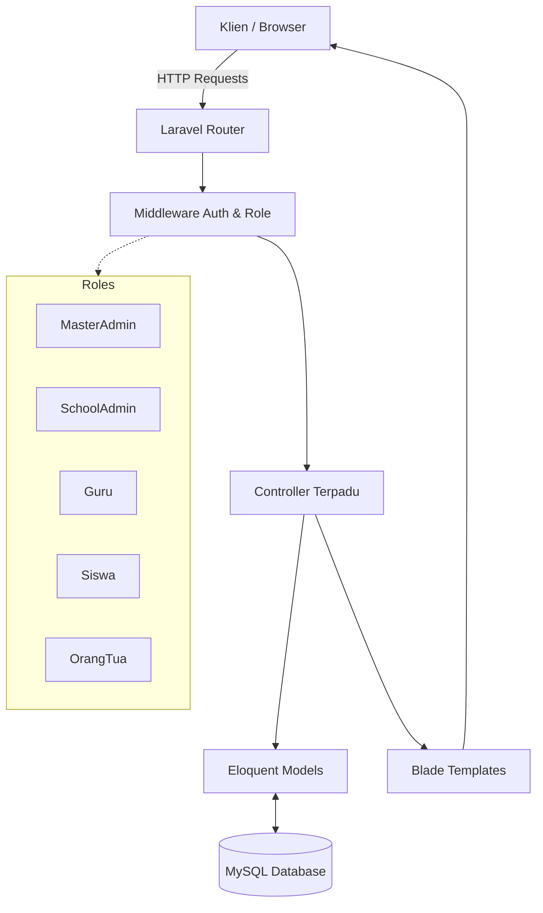

<div align="center">
  
  <br/>
  <h1>Sistem Manajemen G7KAIH</h1>
  <p><strong>Platform Manajemen Sekolah & Pelacakan Kebiasaan yang Modern dan Komprehensif</strong></p>
  
  <p>
    <a href="#"></a>
    <a href="#"></a>
    <a href="#"></a>
    <a href="#"></a>
    <a href="#"></a>
  </p>
</div>

<br/>

## Ringkasan Proyek

**G7KAIH** adalah sistem manajemen pendidikan mutakhir yang dilengkapi dengan pelacakan kebiasaan siswa. Dirancang untuk menjembatani komunikasi antara pendidik, siswa, dan orang tua, platform ini menyediakan antarmuka berbasis peran untuk memantau aktivitas harian, kebiasaan spiritual (seperti Absensi Sholat), dan perkembangan akademik.

Dengan mendigitalisasi alur pengiriman dan validasi kebiasaan, G7KAIH menghilangkan pencatatan manual, mengurangi beban administratif, dan mendorong lingkungan kolaboratif untuk pengembangan karakter siswa.

---

## Fitur Utama

| Fitur | Deskripsi | Manfaat |
|---------|-------------|---------|
| **Advanced RBAC** | Kontrol akses bertingkat (MasterAdmin, SchoolAdmin, Guru, Siswa, Orang Tua). | Memastikan keamanan data dan akses yang sesuai konteks untuk setiap jenis pengguna. |
| **Pelacakan Kebiasaan** | Pengiriman aktivitas harian dan kebiasaan spiritual dengan pilihan multi-tag. | Mendorong konsistensi dan tanggung jawab dalam rutinitas siswa. |
| **Alur Validasi** | Proses persetujuan bertahap di mana orang tua memvalidasi dan guru memberikan poin. | Menjaga integritas data dan memastikan keterlibatan orang tua. |
| **Pelaporan Dinamis** | Analisis dan pelaporan komprehensif dengan kemampuan ekspor data. | Memberdayakan pendidik dengan wawasan mendalam tentang perkembangan siswa. |
| **Notifikasi Global** | Sistem template notifikasi terpusat untuk peringatan di seluruh sistem. | Menjaga semua pihak agar tetap mendapat informasi penting secara real-time. |
| **UI Responsif** | Desain *mobile-first* menggunakan Tailwind CSS dengan komponen khusus yang mulus. | Memberikan pengalaman pengguna yang sempurna di semua perangkat. |

---

## Teknologi yang Digunakan

Platform ini dibangun menggunakan teknologi modern berstandar industri untuk memastikan skalabilitas, performa, dan kemudahan pemeliharaan:

<p align="center">
  
  
  
  
  
  
</p>

---

## Panduan Instalasi

Ikuti langkah-langkah berikut untuk menjalankan proyek ini di lingkungan lokal.

### Prasyarat
- PHP 8.2 atau lebih tinggi
- Composer
- Node.js & NPM
- MySQL Database

### Langkah-langkah

1. **Clone repositori**
   ```bash
   git clone https://github.com/sultannafis/G7KAIH.git
   cd G7KAIH
   ```

2. **Instal dependensi PHP**
   ```bash
   composer install
   ```

3. **Instal dependensi NPM**
   ```bash
   npm install
   ```

4. **Pengaturan Environment (.env)**
   ```bash
   cp .env.example .env
   php artisan key:generate
   ```
   *Sesuaikan file `.env` dengan kredensial database Anda.*

5. **Migrasi Database & Seeding**
   ```bash
   php artisan migrate --seed
   ```

6. **Build Aset**
   ```bash
   npm run build
   ```

7. **Jalankan Server Development**
   ```bash
   php artisan serve
   ```

**Kredensial Default:**
*(Silakan periksa `DatabaseSeeder.php` untuk akun kredensial bawaan yang tersedia)*

---

## Konfigurasi API (Layanan Pihak Ketiga)

Aplikasi ini menggunakan beberapa layanan API pihak ketiga untuk mendukung berbagai fiturnya. Berikut adalah penjelasan fungsi dan cara mendapatkan kredensial untuk setiap API yang ada di file `.env`:

### 1. Green API (WhatsApp Gateway)
Digunakan untuk mengirimkan notifikasi pesan otomatis melalui WhatsApp kepada pengguna (misalnya: pengingat persetujuan, pemberitahuan akun, notifikasi poin).
- **Cara Mendapatkan:** Daftar di [Green API](https://green-api.com/). Buat *instance* baru, lalu salin `ID Instance` dan `Token API`.
- **Variabel .env:** `GREEN_API_INSTANCE_ID`, `GREEN_API_TOKEN`.

### 2. Cloudinary
Digunakan sebagai layanan penyimpanan *cloud* untuk aset media (misalnya: unggahan tanda tangan digital, foto profil pengguna). Ini mengurangi beban penyimpanan file gambar di server lokal.
- **Cara Mendapatkan:** Buat akun di [Cloudinary](https://cloudinary.com/). Di halaman dasbor Anda, terdapat kredensial untuk *Cloud Name*, *API Key*, dan *API Secret*.
- **Variabel .env:** `CLOUDINARY_CLOUD_NAME`, `CLOUDINARY_API_KEY`, `CLOUDINARY_API_SECRET`.

### 3. Layanan AI (Gemini & Groq)
Digunakan untuk mendukung fitur berbasis kecerdasan buatan dalam aplikasi.
- **Cara Mendapatkan Gemini:** Dapatkan API Key secara gratis dari [Google AI Studio](https://aistudio.google.com/).
- **Cara Mendapatkan Groq:** Daftar dan dapatkan API Key di [Groq Console](https://console.groq.com/).
- **Variabel .env:** `GEMINI_API_KEY`, `GROQ_API_KEY`.

### 4. Google reCAPTCHA
Berfungsi untuk mengamankan form pendaftaran, login, atau input penting lainnya dari serangan *spam* dan *bot*.
- **Cara Mendapatkan:** Daftarkan domain aplikasi Anda di [Google reCAPTCHA Admin Console](https://www.google.com/recaptcha/admin/).
- **Variabel .env:** `RECAPTCHA_SITE_KEY`, `RECAPTCHA_SECRET_KEY`.

### 5. Aladhan API (Jadwal Sholat)
API publik ini digunakan untuk mengambil data jadwal waktu sholat harian yang akurat berdasarkan lokasi dan zona waktu untuk modul Absensi Sholat.
- **Cara Penggunaan:** API ini bersifat terbuka dan tidak memerlukan pendaftaran atau *API Key*. Cukup pastikan URL bawaan (`ALADHAN_BASE_URL`) dan zona waktu (`ALADHAN_TIMEZONE=Asia/Jakarta`) terkonfigurasi dengan benar di file `.env`.

---

## Panduan Penggunaan

### Alur Kerja Umum
1. **SchoolAdmin** mengatur tahun ajaran, kelas, dan akun pengguna.
2. **Siswa** login setiap hari untuk mengirimkan laporan aktivitas dan kebiasaan mereka (misalnya, kehadiran sholat).
3. **Orang Tua** meninjau dan memvalidasi laporan tersebut melalui portal khusus mereka.
4. **Guru** meninjau pengiriman yang telah divalidasi, memberikan nilai/poin, dan memantau kinerja kelas secara keseluruhan melalui dasbor analitik.

---

## Manfaat Proyek

- **Peningkatan Produktivitas:** Mengotomatiskan entri data manual dan pembuatan laporan.
- **Kolaborasi yang Lebih Baik:** Melibatkan orang tua secara aktif dalam perkembangan harian anak mereka.
- **Keputusan Berbasis Data:** Memberikan metrik yang jelas kepada guru tentang pola perilaku siswa.
- **Arsitektur yang Skalabel:** Dibangun menggunakan Laravel, memastikan sistem dapat berkembang seiring pertumbuhan institusi.

---

## Struktur Folder

Gambaran tingkat tinggi dari struktur inti aplikasi:

```text
G7KAIH/
├── app/
│   ├── Http/
│   │   └── Controllers/
│   │       ├── MasterAdmin/
│   │       ├── SchoolAdmin/
│   │       └── UserManagement/      # Logika RBAC Terpusat
│   └── Models/
├── database/
│   ├── migrations/
│   └── seeders/
├── resources/
│   ├── css/
│   ├── js/
│   └── views/
│       ├── components/              # Komponen Blade yang dapat digunakan kembali
│       └── shared/
│           └── user-management/     # Template tampilan yang digabungkan
├── routes/
│   └── web.php
└── tailwind.config.js
```

---

## Arsitektur Sistem



---

## Berkontribusi

Kami menyambut kontribusi untuk meningkatkan G7KAIH! Ikuti langkah-langkah berikut:

1. *Fork* repositori ini.
2. Buat *branch* baru (`git checkout -b feature/FiturLuarBiasa`).
3. Lakukan *commit* pada perubahan Anda (`git commit -m 'Menambahkan FiturLuarBiasa'`).
4. Lakukan *push* ke *branch* Anda (`git push origin feature/FiturLuarBiasa`).
5. Buat sebuah *Pull Request*.

---

## Lisensi

Proyek ini bersifat *open-source* dan dilisensikan di bawah [Lisensi MIT](LICENSE).

---

<div align="center">
  <p>Dibuat untuk memajukan manajemen pendidikan.</p>
</div>
