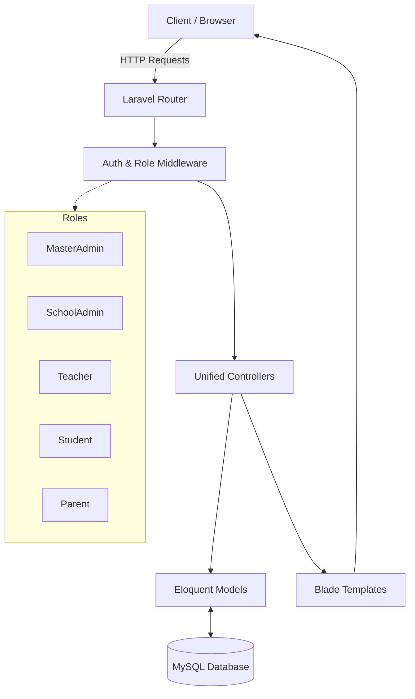

<div align="center">
  
  <br/>
  <h1>G7KAIH Management System</h1>
  <p><strong>A Modern, Comprehensive School & Habit Tracking Platform</strong></p>
  
  <p>
    <a href="#"></a>
    <a href="#"></a>
    <a href="#"></a>
    <a href="#"></a>
    <a href="#"></a>
  </p>
</div>

<br/>

## Project Overview

**G7KAIH** is a state-of-the-art educational management and student habit-tracking system. Designed to bridge the communication gap between educators, students, and parents, it provides an intuitive, role-based platform for monitoring daily activities, spiritual habits, and academic progress. 

By digitalizing habit submissions and validation workflows, G7KAIH eliminates manual tracking, reduces administrative overhead, and fosters a collaborative environment for student character development.

---

## Key Features

| Feature | Description | Benefit |
|---------|-------------|---------|
| **Advanced RBAC** | Multi-tiered access control (MasterAdmin, SchoolAdmin, Teacher, Student, Parent). | Ensures secure, context-aware data access for every user type. |
| **Habit Tracking** | Daily submission of activities and spiritual habits with multi-select tags. | Encourages consistency and accountability in student routines. |
| **Validation Flow** | Multi-step approval process where parents validate and teachers assign points. | Maintains data integrity and ensures parental involvement. |
| **Dynamic Reporting** | Comprehensive analytics and reporting with export capabilities. | Empowers educators with actionable insights on student progress. |
| **Global Notifications** | Centralized notification template system for system-wide alerts. | Keeps all stakeholders informed of critical updates in real-time. |
| **Responsive UI** | Mobile-first design using Tailwind CSS with seamless custom components. | Delivers a flawless user experience across all devices. |

---

## Tech Stack

The platform is built using modern, industry-standard technologies to ensure scalability, performance, and maintainability:

<p align="center">
  
  
  
  
  
  
</p>

---

## UI/UX Preview

> **Note:** Replace the image URLs below with actual screenshots of your application before publishing.

<div align="center">
  
  
</div>

---

## Installation Guide

Follow these steps to set up the project locally.

### Prerequisites
- PHP 8.2 or higher
- Composer
- Node.js & NPM
- MySQL Database

### Step-by-Step

1. **Clone the repository**
   ```bash
   git clone https://github.com/your-username/G7KAIH.git
   cd G7KAIH
   ```

2. **Install PHP dependencies**
   ```bash
   composer install
   ```

3. **Install NPM dependencies**
   ```bash
   npm install
   ```

4. **Environment Setup**
   ```bash
   cp .env.example .env
   php artisan key:generate
   ```
   *Update your `.env` file with your database credentials.*

5. **Database Migration & Seeding**
   ```bash
   php artisan migrate --seed
   ```

6. **Build Assets**
   ```bash
   npm run build
   ```

7. **Run the Development Server**
   ```bash
   php artisan serve
   ```

**Default Credentials:**
- **Admin:** `admin@example.com` / `password`
*(Check `DatabaseSeeder.php` for exact default credentials)*

---

## Usage Guide

### Workflow Overview
1. **SchoolAdmin** configures the academic year, classes, and user accounts.
2. **Students** log in daily to submit their activities and habits.
3. **Parents** review and validate these submissions via their dedicated portal.
4. **Teachers** review the validated submissions, assign scores/points, and monitor overall class performance through the analytics dashboard.

---

## Project Benefits

- **Increased Productivity:** Automates manual data entry and report generation.
- **Enhanced Collaboration:** Keeps parents actively involved in their child's daily development.
- **Data-Driven Decisions:** Provides teachers with clear metrics on student behavioral patterns.
- **Scalable Architecture:** Built on Laravel, ensuring the system can grow with the institution.

---

## Folder Structure

A high-level overview of the application's core structure:

```text
G7KAIH/
├── app/
│   ├── Http/
│   │   └── Controllers/
│   │       ├── MasterAdmin/
│   │       ├── SchoolAdmin/
│   │       └── UserManagement/      # Centralized RBAC logic
│   └── Models/
├── database/
│   ├── migrations/
│   └── seeders/
├── resources/
│   ├── css/
│   ├── js/
│   └── views/
│       ├── components/              # Reusable Blade components
│       └── shared/
│           └── user-management/     # Consolidated view templates
├── routes/
│   └── web.php
└── tailwind.config.js
```

---

## System Architecture



---

## Contributing

We welcome contributions to improve G7KAIH! Please follow these steps:

1. Fork the repository.
2. Create a new branch (`git checkout -b feature/AmazingFeature`).
3. Commit your changes (`git commit -m 'Add some AmazingFeature'`).
4. Push to the branch (`git push origin feature/AmazingFeature`).
5. Open a Pull Request.

---

## License

This project is open-source and licensed under the [MIT License](LICENSE).

---

<div align="center">
  <p>Built for better education management.</p>
</div>
